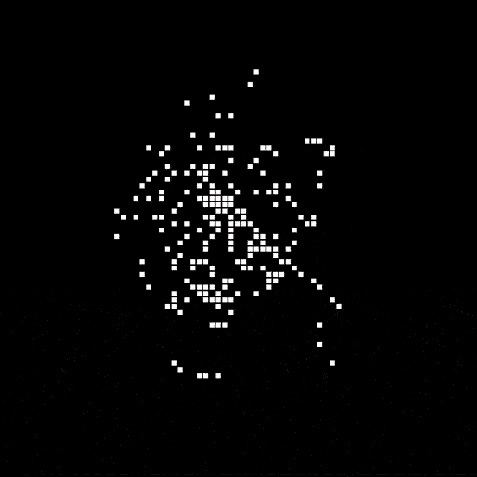
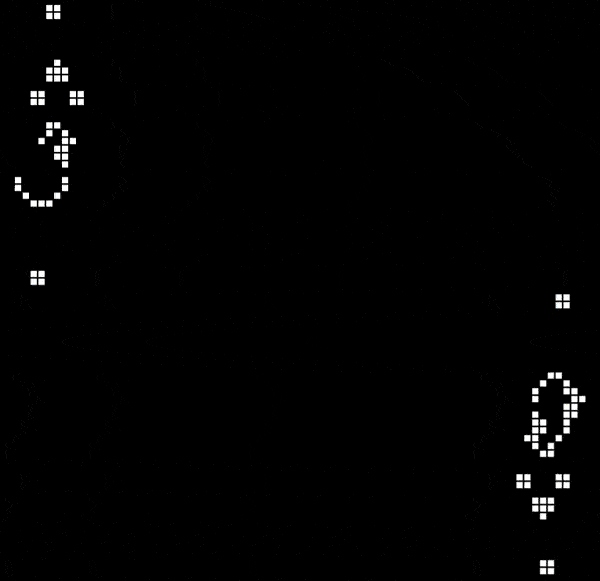
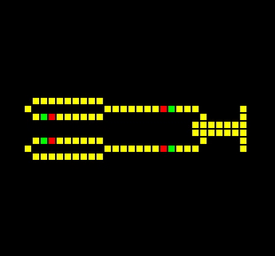

<h1 align="center"> Cellular Automatons </h1>

<p align="middle">
  </img>
  </img>
  </img>
</p>

[Brian's Brain](https://en.wikipedia.org/wiki/Brian%27s_Brain), [Conway's Game of Life](https://en.wikipedia.org/wiki/Conway%27s_Game_of_Life), and [Wireworld](https://en.wikipedia.org/wiki/Wireworld) have been implemented.  

## Usage:

```
cd src
bash run.sh <filename>
```

## Documentation:

`src/` 
- `Helpers.h` : Contains a few trivial helper functions 
- `cells/`  
  - `Cell.h` : Abstract class that describes the nature of a cell in a cellular automaton
  - `BrianCell.h` : Implementation of the cell described in Brian's Brain
  - `ConwayCell.h` : Implementation of the cell described in Conway's Game of Life
  - `WireworldCell.h` : Implementation of cell described in Wireworld
- `configs/`  
  - `Config.h` : Abstract class that stores a particular configuration of the world 
  - `Circuit.h` : Stores the state information for the circuit shown in the [demos/wireworld.gif](demos/wireworld.gif)
  - `Gosper.h` : Stores the state information for [Gosper glider gun](https://conwaylife.com/wiki/Gosper_glider_gun)
- `main_bb.cpp` : Main script for Brian's Brain
- `main_cgol.cpp` : Main script for Conway's Game of Life
- `main_ww.cpp` : Main script for Wireworld
- `run.sh` : Compiles and runs a FLTK program 
- `worlds/`  
  - `BrianWorld.h` : Implementation of Brian's Brain
  - `ConwayWorld.h` : Implementation of the Conway's Game of Life
  - `WireworldWorld.h` : Implementation of Wireworld

---

*(This was done as a lab assignment for CS154: Abstractions and Paradigms for Programming Lab, Spring 2021, IIT Bombay)*
